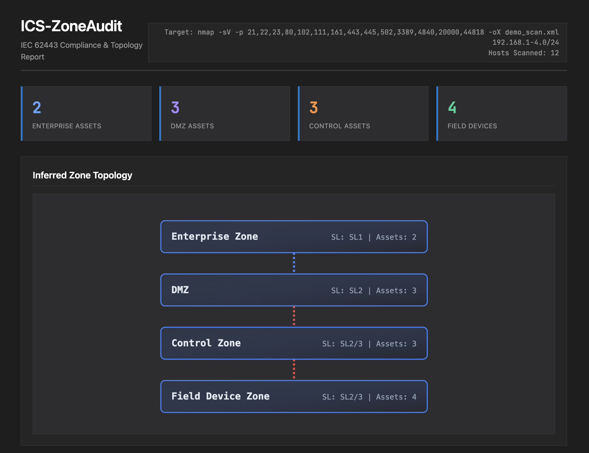
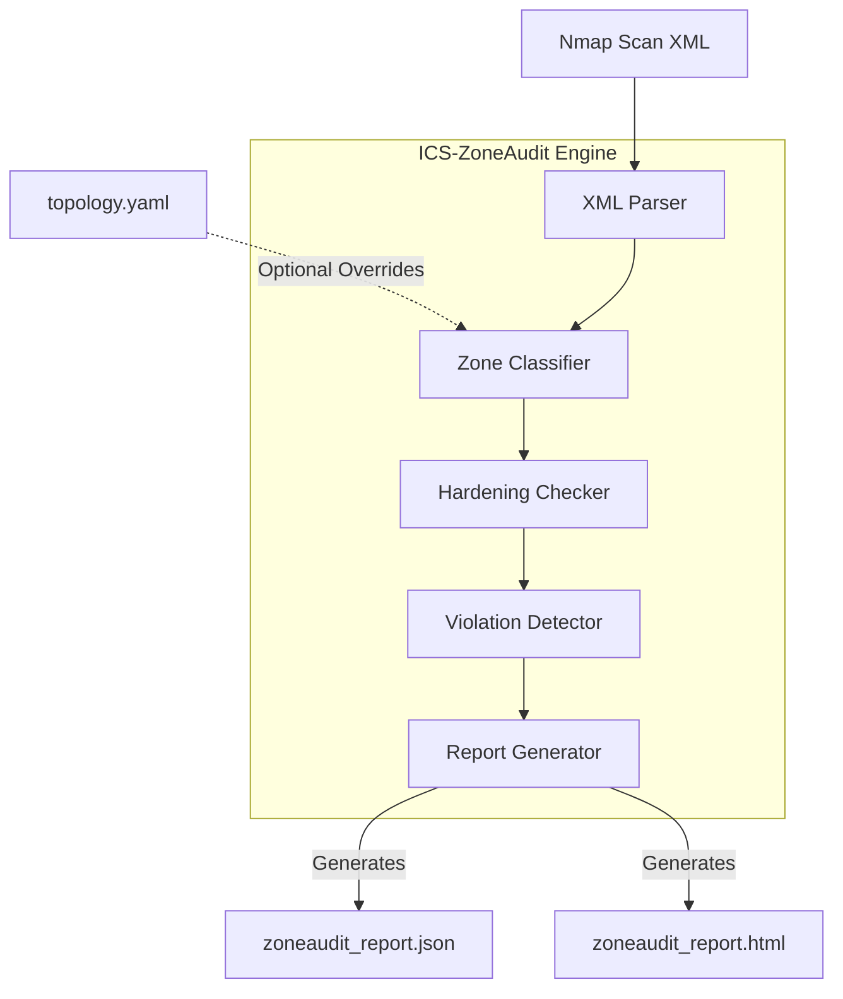
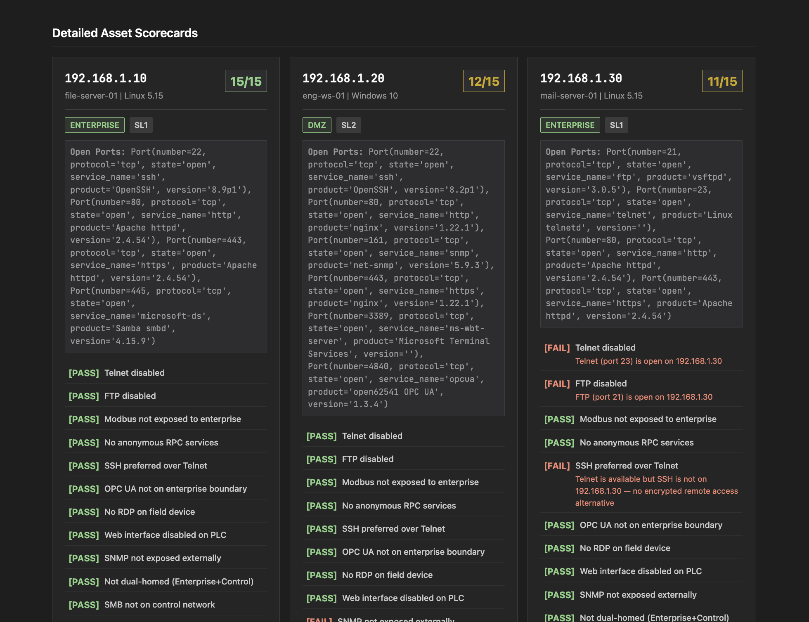

# ICS-ZoneAudit

[](https://opensource.org/licenses/MIT)
[](https://www.python.org/)
[](https://nmap.org/)
[](https://www.isa.org/standards-and-publications/isa-standards/isa-iec-62443-series-of-standards)

A Python CLI tool that ingests an Nmap XML scan of an industrial network, automatically classifies each discovered asset into an **IEC 62443 security zone** (Purdue Model), checks for zone boundary and conduit violations, scores each asset against a hardening checklist, and generates a structured compliance audit report (JSON + HTML).

ICS-ZoneAudit makes IEC 62443 zone and conduit modelling hands-on and tangible. Instead of reading the standard as theory, you can scan a real or simulated network and immediately see how your asset topology maps to the standard.



---

## Table of Contents

- [Background](#background)
- [Project Architecture](#project-architecture)
- [Directory Structure](#directory-structure)
- [Heuristics & Rule Engines](#heuristics--rule-engines)
  - [Zone Classification](#zone-classification)
  - [Hardening Checklist](#hardening-checklist)
  - [Conduit Violations](#conduit-violations)
- [Quick Start](#quick-start)
- [Custom Topology Overrides](#custom-topology-overrides)
- [Optional Docker OT Lab](#optional-docker-ot-lab)
- [Sample Output](#sample-output)
- [License](#license)

---

## Background

The **IEC 62443** series is the dominant international standard for Operational Technology (OT) and Industrial Control Systems (ICS) cybersecurity. A core concept of IEC 62443 is segmentation into **Zones and Conduits**:
- **Zones:** Groups of logical or physical assets that share common security requirements (e.g., Enterprise, DMZ, Control, Field Device).
- **Conduits:** The communication pathways between these zones.

Securing an OT network requires ensuring that these zones are properly segregated, that firewalls sit on the boundary conduits, and that individual devices within the zones are hardened according to their target Security Level (SL).

**ICS-ZoneAudit** automates this assessment. By running a standard network scan (Nmap), the tool uses a combination of port profiling and hostname heuristics to reconstruct the zone model, find illegal conduits (like a PLC bridging the field network directly to the corporate LAN), and grade the assets.

---

## Project Architecture



The tool is entirely static and offline. It processes the XML file through a pipeline of rule engines, building up a rich `Asset` object model before finally passing it to the Jinja2 reporter.

---

## Directory Structure

```
ICS-ZoneAudit/
├── ics_zoneaudit.py            # Main CLI entry-point and orchestrator
├── requirements.txt            # Python dependencies (Jinja2, PyYAML, libnmap)
│
├── core_engines/               # (Conceptual)
│   ├── classifier.py           # Port/hostname heuristics to determine Zones & SLs
│   ├── checker.py              # Assesses assets against the Hardening Checklist
│   ├── violations.py           # Evaluates cross-asset relationships for illegal conduits
│   └── reporter.py             # JSON generation and Jinja2 HTML rendering
│
├── templates/
│   └── report.html.j2          # Jinja2 template for the interactive HTML dashboard
│
├── tests/
│   ├── test_classifier.py      # Pytest unit tests for the classification logic
│   └── test_checker.py         # Pytest unit tests for the hardening logic
│
├── samples/
│   ├── demo_scan.xml           # Simulated Nmap XML of a 12-host OT environment
│   └── topology.yaml           # Example manual override configuration
│
└── lab/
    ├── docker-compose.yml      # Optional simulated OT lab environment
    └── README.md               # Instructions for running the Docker lab
```

---

## Heuristics & Rule Engines

### Zone Classification

The tool places assets into one of four zones (Enterprise, DMZ, Control, Field Device) based on their exposed services. 

- **Field Device:** Detected if protocols like Modbus (502), DNP3 (20000), or S7comm (102) are open.
- **Control:** Detected via protocols like EtherNet/IP (44818), OPC UA (4840) alongside other indicators, or hostnames like `scada` or `hmi`.
- **DMZ:** Detected via a mix of remote access (SSH/RDP) and web services without ICS protocols, or specific hostnames (`vpn`, `historian`).
- **Enterprise:** Default for standard IT services (SMB, email, generic web) lacking any industrial indicators.

### Hardening Checklist

The `checker.py` engine assesses every asset against a robust checklist mapped to IEC 62443-3-3 (System Security Requirements) and NIST 800-82.

| ID | Name | Trigger Condition |
|----|------|-------------------|
| **H-01** | Telnet disabled | Port 23 is open. |
| **H-02** | FTP disabled | Port 21 is open. |
| **H-03** | Modbus not exposed | Asset is in Field Device zone, Port 502 is open, and there is no boundary firewall (inferred from scan topology). |
| **H-07** | Default ICS creds changed | Checks for specific known-vulnerable ports without authentication. |
| **H-10** | Not dual-homed | Asset runs both strong Enterprise protocols (RDP) and Control protocols (Modbus). |
| **H-14** | Subnet Segmentation | Field Device and Enterprise assets share the same /24 subnet. |

*(Note: There are 15 hardening checks in total (H-01 to H-15) covering secure access, legacy protocols, and network hygiene).*

### Conduit Violations

The `violations.py` engine detects architectural flaws by evaluating relationships *between* assets.

| ID | Severity | Type | Trigger Condition |
|----|----------|------|-------------------|
| **V-001** | HIGH | Dual-homed asset | Asset is assigned to a specific zone but has IPs on multiple subnets (bridging zones). |
| **V-006** | HIGH | No firewall evidence | Field or Control asset is on the exact same subnet as an Enterprise asset. |
| **V-009** | MEDIUM | Enterprise protocol on OT | Control or Field asset exposes typical IT protocols (SMB, RDP) without a DMZ proxy. |
| **V-012** | MEDIUM | Insecure protocol | Telnet/FTP found on an asset in the Control or Field Device zone. |

---

## Quick Start

### 1. Installation

Requires Python 3.11+. 

```bash
git clone https://github.com/arnavparekar/ics-zoneaudit.git
cd ics-zoneaudit
pip install -r requirements.txt
```

### 2. Run on the Sample Scan

Test the tool against the provided sample Nmap XML, which contains a simulated 12-host OT environment with intentional flaws.

```bash
python3 ics_zoneaudit.py --input samples/demo_scan.xml --format both
```

This will instantly generate `zoneaudit_report.json` and `zoneaudit_report.html`. Open the HTML file in any browser to explore the dashboard.

### 3. Run a Real Scan

To audit your own environment, first run an Nmap scan with version detection (`-sV`) and output it to XML (`-oX`):

```bash
sudo nmap -sV -p- -oX my_network.xml 192.168.1.0/24 192.168.2.0/24
```

Then run ICS-ZoneAudit on the resulting XML file:

```bash
python3 ics_zoneaudit.py --input my_network.xml --output my_audit_report
```

---

## Custom Topology Overrides

Because network scans cannot perfectly deduce intent, the classifier heuristics can be overridden. You can supply a `topology.yaml` file to explicitly bind specific IPs or entire subnets to a zone.

**topology.yaml**
```yaml
zones:
  Enterprise:
    - 192.168.1.10         # Exact IP match
  DMZ:
    - 192.168.2.0/24       # Entire subnet match
  Control:
    - 192.168.3.0/24
  Field Device:
    - 192.168.4.0/24
```

Run with the config override:
```bash
python3 ics_zoneaudit.py --input my_network.xml --config topology.yaml
```

---

## Optional Docker OT Lab

If you don't have access to a real ICS network to scan, this repository includes a simulated miniature OT network built with Docker Compose.

1. Navigate to the `lab/` directory and start the stack:
   ```bash
   cd lab
   docker compose up -d
   ```
2. Scan the lab environment (assuming standard Docker bridge IP allocations):
   ```bash
   nmap -sV -p- -oX lab_scan.xml 192.168.1.0/24 192.168.2.0/24 192.168.3.0/24 192.168.4.0/24
   ```
3. Run the audit against your new scan:
   ```bash
   python3 ../ics_zoneaudit.py --input lab_scan.xml
   ```

*See `lab/README.md` for more details on the simulated misconfigurations.*

---

## Sample Output

The HTML dashboard uses a professional, industrial dark theme to present the audit findings. It includes:
- **Zone Summary Dashboard:** A quick metric view of how many assets were discovered in each zone.
- **Inferred Zone Topology:** An auto-generated SVG diagram showing the Purdue model layers, asset counts, and any detected illegal conduits (highlighted in red).
- **Violations Table:** A clear table listing architectural flaws, their severity, and affected assets.
- **Detailed Asset Scorecards:** Individual cards for every host showing their assigned Zone, Security Level (SL), open ports, and pass/fail status for the hardening checklist.



---

## License

This project is licensed under the MIT License — see the [LICENSE](LICENSE) file for details.
